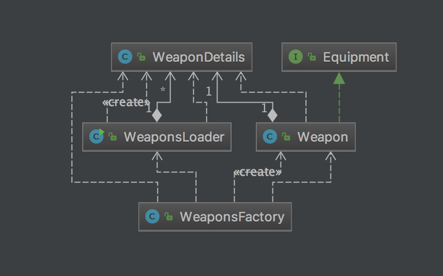

# Creating Weapons and Armor

run **gradlew eclipse** then import this as a Java project.

We're going to use some standard OO Programming techniques to load and create weapons (Weapon.java) and armor (Armor.java). Both the Weapon and Armor class will implement an Equipment interface.

The two patterns we'll use are:
* **Singleton** to load the weapon details
* **Factory Pattern** to create individual weapons

### Weapons

We will start with weapons and will create the following classes:
[weapons uml diagram](src/main/resources/diagrams/weapons-uml.png)

The stats for the weapons can be found in the Player's Handbook on pages 117, 118 of the [Players Handbook](src/main/resources/docs/PlayersHandbook.pdf)

#### WeaponsLoader
WeaponsLoader will load the WeaponDetails for all the Weapon(s). Initially we will hardcode the details for four weapons (Longsword, Mace, Rapier, Warhammer) in the WeaponsLoader class. Then we will create the option to load weapons from a file [weapons.txt](src/main/resources/data/weapons.txt).

WeaponsLoader should do the following:
* be a Singleton that can not be instantiated
* load the weapon details only **once**
* have a public static method that takes a weapon name as a String (eg "longsword") and returns the WeaponDetails for that weapon.
* should decide whether or not to load the weapons from the filesystem or the statically coded weapon list based on the value of the **weapon_source** property in the file [adventure.props](src/main/resources/adventure.props). (note the supplied PropertyLoader.java class loads this file for you)

#### WeaponDetails
WeaponDetails contain all the information that is common to all weapons of a given type. For example all longswords cost 12GP, weigh 4 pounds, do 1d8 damage, have a critical hit threshold of 19 and do double damage on a critical hit:

longsword, 15, 4, 1, 8, 19, 2

#### WeaponsFactory
Is a Factory Pattern class. You ask it for a weapon by name (eg "longsword") and it creates one and returns it to you. It asks the WeaponsLoader for the WeaponsDetails then instantiates a Weapon and return it.

#### Weapon
Is an instance of a WeaponDetails class. It contains a WeaponDetails and also adds a description and a magic bonus value. While there is only one WeaponDetails for each weapon type there are instances of a Weapon for each real weapon of that type. For example, if a store has 5 longswords there will be 1 WeaponDetails of type longsword and 5 Weapon(s) of type longsword.

### Armor
Now do the same thing for Armor that you did for weapons.

### Important Points
Encapsulation is a key part of Object Oriented programming. Only the WeaponsLoader should know how the weapons are loaded, when they are loaded, where they are loaded from and how the data is cached (is it read from a file each time or stored in memory).

We should be able to ask the WeaponsFactory for a Weapon and it should instantiate and return one to us without us having to know where it got the weapon from (WeaponsLoader) or how it was instantiated.

Composition: the Weapon is composed of a WeaponDetails and its own fields (description and magic bonus). If the weapon is asked for its' damage then it can ask the WeaponDetails for the base damage then add its magic bonus.

Putting configuration information in a properties file (adventure.props) is standard programming practice. We can change where weapons are being loaded from without changing the Java code and recompiling the application.
